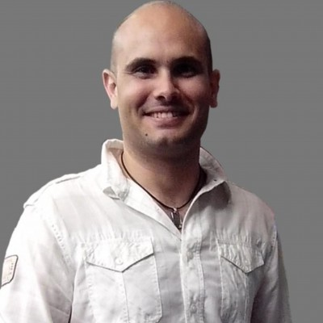

 Hola, soy Jonathan López. Supongo que si estás leyendo esto es que quieres saber un poco más sobre el autor de este blog. Te cuento...

### A qué me dedico.

Trabajo de programador. En el día a día uso C++ con el framework [Qt](https://www.qt.io/), para las aplicaciones web uso JavaScript, PHP5, HTML5 y CSS3. Me gusta trabajar sobre todo con C++.

He sido autónomo como desarrollador web en el pasado. Actualmente trabajo para [Eliwell Iberica](http://www.eliwell.es/) en el departamento de software donde desarrollamos nuevos productos.

### Algunas de mis aficiones

Soy aficionado a la astronomía. De tanto en tanto me voy al culo del mundo, donde no haya contaminación lumínica, y me paso la noche mirando al cielo con mi querido telescopio.

También me gusta dibujar. Creo que soy un pésimo dibujante, pero me relaja y entretiene. También he de decir que todo es práctica.

Me gustaría hacer muchas más cosas pero el tiempo es limitado y hay que descartar lo superfluo (aunque sea bonito o interesante).

### Lo que me preocupa e interesa

*Me preocupa no avanzar, quedarme estancado*. Siempre quiero mejorar mi forma de hacer las cosas y ser más eficiente. Pero tampoco me obsesiono, ni quiero ser el mejor ni soy competitivo, simplemente quiero mejorar y solo me comparo conmigo mismo.

Por eso *me interesa el sistema de organización personal GTD*. Quiero convertirlo en un hábito sólido en mi vida. ¿Por qué? Porque creo que es una herramienta muy buena, un medio eficaz, que puedo usar para alcanzar mis metas y objetivos.

*Me interesa formarme.* Por dos razones:

1. Aspiro a ser un mejor profesional, cada día un poco mejor de lo que era ayer. Como me dedico a la programación me interesan mucho los temas sobre código limpio, programación ágil, desarrollo guiado por test, arquitecturas, etc. Me falta mucho por aprender pero aspiro a convertir mis códigos en obras de arte eficientes y fiables. 
2. Como soy curioso por naturaleza, para sentirme realizado y aprender.

Mi herramienta de trabajo es el ordenador, me encanta y es con lo que me gano el pan. De ahí que quiera aprender a usarlo lo mejor posible. Me esfuerzo por mejorar mi mecanografía (uso el *[teclado Dvorak](https://es.wikipedia.org/wiki/Teclado_Dvorak)*), aprender atajos de teclado, saber cómo configurar y sacar el máximo partido a las aplicaciones que más uso... ¿Conocéis a algún "buen profesional" que no sepa usar *bien* sus herramientas del día a día? Yo no.

Como lo que soy, lo que siento y pienso afecta directamente a lo que hago y cómo me relaciono con los demás *me preocupa conocerme bien, analizarme y ver en qué puedo mejorar*. A menudo me pregunto *"¿Soy **realmente** la persona que me gustaría ser? ¿Qué tengo que cambiar para serlo?"*. Así que me interesan los temas de auto-conocimiento, autodisciplina, constancia y hábitos.

*Quiero vivir tranquilo.* De ahí que busque simplificar mi vida, tener un estilo de vida minimalista. No quiero caer en el consumismo estúpido, endeudarme y tener la casa llena de trastos que no uso y me agobian.

Supongo que si estás leyendo esto eres como yo y estás inquieto por tu desarrollo personal y profesional como programador. Así que desde ya te invito a seguir leyendo este blog y compartir tus opiniones en los comentarios y me ayudes compartiendo lo que lees con tus amigos en las redes sociales.

### Por qué he creado este blog

- **Para ayudarte a ti**. Si sientes que necesitas cambiar y mejorar espero ayudarte. Aquí publicaré todo aquello que a mí personalmente me ha ayudado y espero te sirva a ti también. 
- Para mejorar como programador. Todo lo que publique sobre programación me ha ayudado *en el día a día* y creo que es *realmente práctico*. Ojalá te sea útil y te saque de algún que otro apuro.
- Devuelvo así el favor. A mi me han ayudado mucho los artículos, tutoriales, manuales y vídeos que la gente ha publicado en Internet. Me han ayudado a formarme y mejorar. Yo también quiero contribuir.
- Para recopilar toda la información sintetizada que me ha ayudado tanto en productividad personal como en el cámbio de hábitos. 
- Para hacer público algunas ideas y opiniones que considero interesantes. 
- Para crear mi marca personal. No solo quiero decir que se de algo, sino también demostrarlo.

### Por qué uso un sitio web estático

- Porque no necesito más. 
- Quiero algo simple y minimalista, como el estilo de vida que quiero para mi.
- Me quiero centrar en el contenido, no en la administración del blog. 
- Quiero ayudarte a concentrarte en lo importante, no quiero distraerte con cosas superfluas.
- Escribo pensando que la información que aporto es práctica y útil. Que me lea quien quiera. Lo demás me da igual.

### Conclusión

Soy un ingeniero técnico de teleco, que se dedica a programar. Con mucha curiosidad y que siempre quiere seguir aprendiendo y mejorar la forma de vivir y hacer las cosas. Si tu también quieres y buscas lo mismo, eres bienvenido a realizar el camino conmigo.

Y ya que le dedico tiempo a investigar, recopilar, leer y aprender... lo que saque de ello lo quiero publicar aquí para beneficio del que tenga a bien leerme. 

***¡Un saludo a todos!***

PD. Para cualquier comentario o consulta mi correo electónico es `jolouster @ gmail . com`
